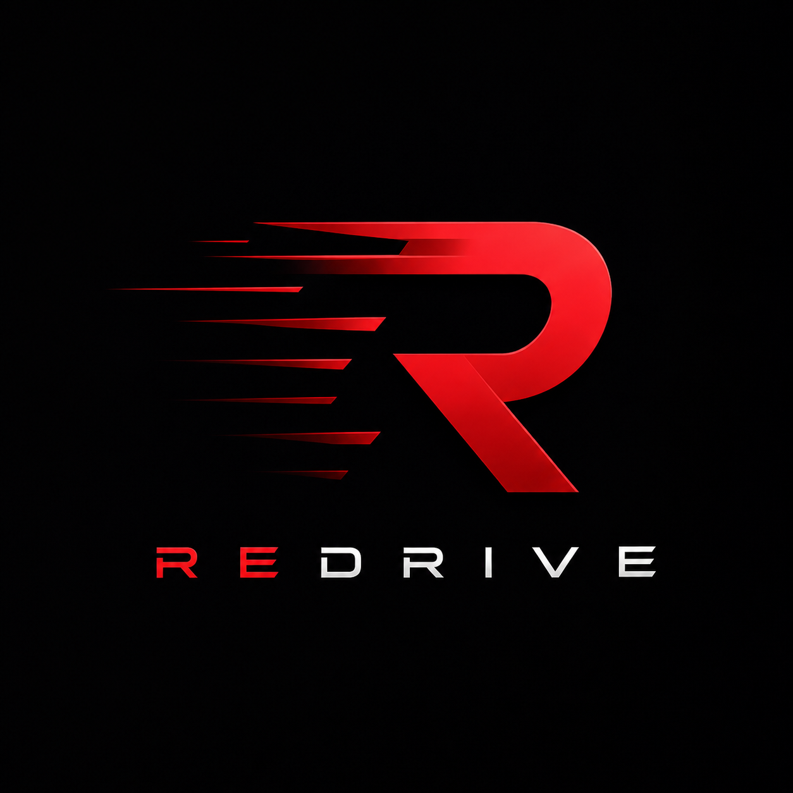
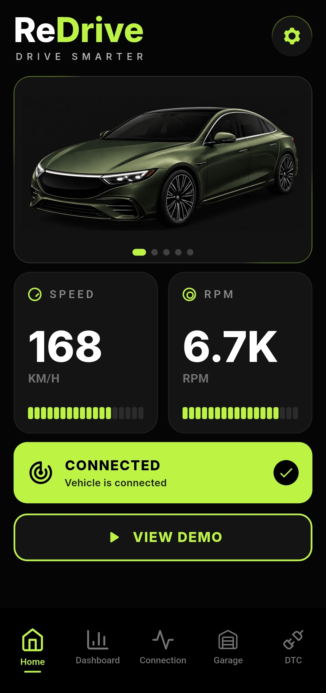

<a id="readme"></a>
# ReDrive
> **ReDrive** is an open-source application for working with OBD2 adapters, allowing you to connect to your car via Bluetooth, Wi-Fi, or USB, read sensor data, diagnose errors, and much more.
<div align="center">
  
</div>
<br>
<p align="center">  
  
  
  
<a href="https://github.com/iUnreallx/ReDrive/issues">
  
</a>

  
</p>
<p align="center">
  <a href="README.md">
    
  </a>
  <a href="README_ru.md">
    
  </a>
</p>

<details>
  <summary>Table of Contents</summary>
  <ol>
    <li>
      <a href="#about-the-project">About The Project</a>
      <ul>
        <li><a href="#built-with">Built With</a></li>
      </ul>
    </li>
    <li><a href="#app-interface">App Interface</a></li>
    <li><a href="#why-redrive">Why ReDrive?</a></li>
    <li><a href="#supported-adapters">Supported Adapters</a></li>
    <li><a href="#installation-and-setup">Installation and Setup</a></li>
    <li><a href="#repository-structure">Repository Structure</a></li>
    <li><a href="#how-to-use">How To Use</a></li>
    <li><a href="#roadmap">Roadmap</a></li>
    <li><a href="#contributing">Contributing</a></li>
    <li><a href="#license">License</a></li>
    <li><a href="#contact">Contact</a></li>
  </ol>
</details>


## About The Project
**ReDrive** is created for those who want to have full control over their car through a modern, fast, and convenient interface. The application reads telemetry from the ECU in real-time, translates it into a readable format, and allows for basic diagnostics.

**Key Features:**
*   **Read and Clear Errors (DTC):** Scanning for fault codes (Check Engine) with detailed decoding and the ability to clear them.
*   **Real-time Monitoring (Live Data):** Monitoring RPM, speed, coolant temperature, voltage, and dozens of other parameters without delays.
*   **Modern Dashboard:** A customizable instrument panel with a clean UI that doesn't distract from the road.
*   **Stable Connection:** Support for various communication protocols such as Bluetooth, Wi-Fi, USB, and automatic connection recovery.

## Built With

* [](https://flutter.dev/)
* [](https://dart.dev/)

## App Interface
<div style="display: flex; justify-content: center; gap: 10px;">
  
  
</div>

## Why ReDrive?
The OBD2 application market is overflowing with outdated solutions, cluttered with ads, complicated interfaces, or hidden subscriptions.

We are creating an alternative based on three principles:
1.  **Open-Source:** Completely open source code. You can check the security, fork the project, or help in its development.
2.  **UI/UX First:** No visual clutter. Only the data you need right now, in a pleasant design.
3.  **Free and Without Ads:** All diagnostic functionality is available "out of the box" without paywalls.

## Supported Adapters
The application works with most popular diagnostic scanners:
*   Any **ELM327**-compatible adapters (Bluetooth, Wi-Fi, USB).
*   *Adapters version v1.5 (on PIC18F25K80 chips) are recommended for maximum compatibility with all vehicle protocols.*

## Installation and Setup

To build the project, you will need the [Flutter SDK](https://docs.flutter.dev/get-started/install) installed.

1. Clone the repository
```sh
git clone https://github.com/iUnreallx/ReDrive.git
```

2. Navigate to the directory
```sh
cd ReDrive
```

3. Install dependencies
```sh
flutter pub get
```

4. Run the project on a connected device
```sh
flutter run
```


## Repository Structure

```sh
ReDrive/
  ├── android/                              # Android platform
  ├── ios/                                  # iOS platform
  ├── assets/                               # png, svg, ico 
  ├── docs/                                 # Documentation and screenshots
  ├── lib/                                  # Flutter source code
  │   ├── main.dart                         # Application entry point
  │   │
  │   ├── core/                             # Theme and basic visual settings
  │   │   ├── app_colors.dart               # App color palette
  │   │   └── app_themes.dart               # App themes
  │   │
  │   ├── models/                           # Data models
  │   │   ├── obd_data.dart                 # OBD data model: speed, RPM, temperature, voltage
  │   │   └── obd_device.dart               # OBD/Bluetooth device model
  │   │
  │   ├── providers/                        # Application state logic
  │   │   ├── bluetooth_provider.dart       # Bluetooth: search, connect, reconnect, status
  │   │   └── obd_provider.dart             # OBD logic: demo mode, polling, data for UI
  │   │
  │   ├── screens/                          # Main pages of the application
  │   │   ├── car_screen.dart               # Car screen / future Garage
  │   │   ├── connect_screen.dart           # Screen for connecting to the OBD adapter
  │   │   ├── home_screen.dart              # Main screen with telemetry
  │   │   └── root_screen.dart              # Root screen with bottom navigation
  │   │
  │   ├── services/                         # Services and abstractions
  │   │   ├── bluetooth_obd_connection.dart # Bluetooth implementation of OBD connection
  │   │   ├── bluetooth_permission_service.dart # Working with Bluetooth permissions
  │   │   ├── demo_data_generator.dart      # Demo data generator
  │   │   └── obd_connection.dart           # Common OBD connection interface
  │   │
  │   ├── utils/                            # Utilities and helper classes
  │   │   └── logger.dart                   # Logging
  │   │
  │   └── widget/                           # UI components of the application
  │       ├── reconnection_banner.dart      # Reconnection banner
  │       │
  │       ├── bottom_bar/                   # Bottom navigation
  │       │   ├── bottom_bar_config.dart    # Bottom navigation configuration
  │       │   ├── bottom_bar_item.dart      # Bottom navigation item
  │       │   └── custom_bottom_bar.dart    # Custom bottom bar
  │       │
  │       ├── connection/                   # Widgets for the connection page
  │       │   └── bluetooth_panel.dart      # Bluetooth connection panel
  │       │
  │       └── home_screen/                  # Widgets for the home screen
  │           ├── car_display.dart          # Car display
  │           ├── connections_buttons.dart  # Connection buttons
  │           ├── header_bar.dart           # Header bar of the home screen
  │           └── telemetry_card.dart       # Telemetry card
  │
  ├── test/                                 # Tests
  ├── pubspec.yaml                          # Packages and dependencies
  ├── README.md                             # Main project description
  └── LICENSE                               # Project license
```

## How To Use?

1. Connect the OBD2 adapter (ELM327) to the car's diagnostic port.
2. Turn on the ignition or start the engine.
3. Pair your smartphone with the adapter (Bluetooth/Wi-Fi/USB).
4. Open **ReDrive**, go to the connection section and select your adapter.

## Roadmap 

A detailed development plan, current tasks, and future features are described in a separate document:
* [View Roadmap](docs/roadmap/roadmap.md)

## Contributing

Community contributions make open-source better. Your suggestions and pull requests are welcome.

1. Fork the repository.
2. Create your branch ('git checkout -b feature/AmazingFeature').
3. Commit your changes ('git commit -m 'Add some AmazingFeature'').
4. Push to the branch ('git push origin feature/AmazingFeature').
5. Open a Pull Request.

### Top Contributors:


<p>
  <a href="https://github.com/iUnreallx/ReDrive/graphs/contributors">
    
  </a>
</p>

## License

The project is distributed under the GNU GPLv3 license. See the [LICENSE](LICENSE) file for details.

## Contact

GitHub: [@iUnreallx](https://github.com/iUnreallx) <br>
Project Link: [https://github.com/iUnreallx/ReDrive](https://github.com/iUnreallx/ReDrive)<br>
Telegram: [Unreallx](https://t.me/unreallx)
<p align="right">(<a href="#readme">back to top</a>)</p>