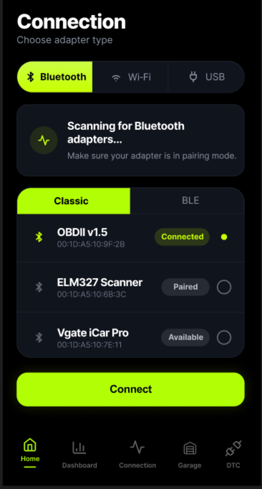

<a id="readme"></a>
# ReDrive
---
> **ReDrive** — это open-source приложение для работы с OBD2-адаптерами, которое позволяет вам подключаться к автомобилю через Bluetooth, Wi-Fi или USB, читать данные с датчиков, диагностировать ошибки и многое другое.
<div align="center">
  
</div>
<br>
<p align="center">  
  
  
  
<a href="https://github.com/iUnreallx/ReDrive/issues">
  
</a>

  
</p>
<p align="center">
  <a href="README.md">
    
  </a>
  <a href="README_ru.md">
    
  </a>
</p>

<details>
  <summary>Оглавление</summary>
  <ol>
    <li>
      <a href="#о-проекте">О проекте</a>
      <ul>
        <li><a href="#спроектирован-с-помощью">Спроектирован с помощью</a></li>
      </ul>
    </li>
    <li><a href="#интерфейс-приложения">Интерфейс приложения</a></li>
    <li><a href="#почему-redrive">Почему ReDrive?</a></li>
    <li><a href="#поддерживаемые-адаптеры">Поддерживаемые адаптеры</a></li>
    <li><a href="#установка-и-запуск">Установка и запуск</a></li>
    <li><a href="#структура-репозитория">Структура репозитория</a></li>
    <li><a href="#как-использовать">Как использовать?</a></li>
    <li><a href="#roadmap">Roadmap</a></li>
    <li><a href="#contributing">Contributing</a></li>
    <li><a href="#лицензия-license">Лицензия</a></li>
    <li><a href="#контакты">Контакты</a></li>
  </ol>
</details>


## О проекте
**ReDrive** создан для тех, кто хочет иметь полный контроль над своим автомобилем через современный, быстрый и удобный интерфейс. Приложение в реальном времени считывает телеметрию с ЭБУ (ECU), переводит её в читаемый вид и позволяет проводить базовую диагностику.

**Ключевые возможности:**
*   **Чтение и сброс ошибок (DTC):** Сканирование кодов неисправностей (Check Engine) с их детальной расшифровкой и возможностью очистки.
*   **Real-time мониторинг (Live Data):** Отслеживание оборотов, скорости, температуры охлаждающей жидкости, напряжения и десятков других параметров без задержек.
*   **Современный дашборд:** Настраиваемая приборная панель с чистым UI, которая не отвлекает от дороги.
*   **Стабильное подключение:** Поддержка различных протоколов связи и автоматическое восстановление соединения таких как Bluetooth, Wi-Fi, USB.

## Спроектирован с помощью

* [](https://flutter.dev/)
* [](https://dart.dev/)

## Интерфейс приложения
<div style="display: flex; justify-content: center; gap: 10px;">
  
  
</div>

## Почему ReDrive?
Рынок OBD2-приложений переполнен устаревшими решениями, перегруженными рекламой, сложными интерфейсами или скрытыми подписками.

Мы создаем альтернативу, опираясь на три принципа:
1.  **Open-Source:** Полностью открытый исходный код. Вы можете проверить безопасность, форкнуть проект или помочь в его развитии.
2.  **UI/UX в приоритете:** Никакого визуального мусора. Только те данные, которые нужны вам прямо сейчас, в приятном дизайне.
3.  **Бесплатно и без рекламы:** Весь диагностический функционал доступен "из коробки" без пейволлов.

## Поддерживаемые адаптеры
Приложение работает с большинством популярных диагностических сканеров:
*   Любые **ELM327**-совместимые адаптеры (Bluetooth, Wi-Fi, USB).
*   *Рекомендуются адаптеры версии v1.5 (на чипах PIC18F25K80) для максимальной совместимости со всеми протоколами автомобилей.*

## Установка и запуск

Для сборки проекта вам потребуется установленный [Flutter SDK](https://docs.flutter.dev/get-started/install).

1. Клонируем репозиторий
```sh
git clone [https://github.com/iUnreallx/ReDrive.git](https://github.com/iUnreallx/ReDrive.git)
```

2. Переходим в директорию
```sh
cd ReDrive
```

3. Устанавливаем зависимости
```sh
flutter pub get
```

4. Запускаем проект на подключенном устройстве
```sh
flutter run
```
<br>


## Структура репозитория

```text
ReDrive/
  ├── android/                              # Android-платформа
  ├── ios/                                  # iOS-платформа
  ├── assets/                               # png, svg, ico 
  ├── docs/                                 # Документация и скриншоты
  ├── lib/                                  # Исходный код Flutter
  │   ├── main.dart                         # Точка входа в приложение
  │   │
  │   ├── core/                             # Тема и базовые визуальные настройки
  │   │   ├── app_colors.dart               # Цветовая палитра приложения
  │   │   └── app_themes.dart               # Темы приложения
  │   │
  │   ├── models/                           # Модели данных
  │   │   ├── obd_data.dart                 # Модель OBD-данных: скорость, RPM, температура, напряжение
  │   │   └── obd_device.dart               # Модель OBD/Bluetooth-устройства
  │   │
  │   ├── providers/                        # Логика состояния приложения
  │   │   ├── bluetooth_provider.dart       # Bluetooth: поиск, подключение, reconnect, состояние
  │   │   └── obd_provider.dart             # OBD-логика: demo mode, polling, данные для UI
  │   │
  │   ├── screens/                          # Основные страницы приложения
  │   │   ├── car_screen.dart               # Экран автомобиля / будущий Garage
  │   │   ├── connect_screen.dart           # Экран подключения к OBD-адаптеру
  │   │   ├── home_screen.dart              # Главный экран с телеметрией
  │   │   └── root_screen.dart              # Корневой экран с нижней навигацией
  │   │
  │   ├── services/                         # Сервисы и абстракции
  │   │   ├── bluetooth_obd_connection.dart # Bluetooth-реализация OBD-подключения
  │   │   ├── bluetooth_permission_service.dart # Работа с Bluetooth-разрешениями
  │   │   ├── demo_data_generator.dart      # Генератор demo-данных
  │   │   └── obd_connection.dart           # Общий интерфейс OBD-подключения
  │   │
  │   ├── utils/                            # Утилиты и вспомогательные классы
  │   │   └── logger.dart                   # Логирование
  │   │
  │   └── widget/                           # UI-компоненты приложения
  │       ├── reconnection_banner.dart      # Баннер переподключения
  │       │
  │       ├── bottom_bar/                   # Нижняя навигация
  │       │   ├── bottom_bar_config.dart    # Конфигурация нижней навигации
  │       │   ├── bottom_bar_item.dart      # Элемент нижней навигации
  │       │   └── custom_bottom_bar.dart    # Кастомный bottom bar
  │       │
  │       ├── connection/                   # Виджеты страницы подключения
  │       │   └── bluetooth_panel.dart      # Bluetooth-панель подключения
  │       │
  │       └── home_screen/                  # Виджеты главного экрана
  │           ├── car_display.dart          # Отображение автомобиля
  │           ├── connections_buttons.dart  # Кнопки подключения
  │           ├── header_bar.dart           # Верхняя панель главного экрана
  │           └── telemetry_card.dart       # Карточка телеметрии
  │
  ├── test/                                 # Тесты
  ├── pubspec.yaml                          # Пакеты и зависимости
  ├── README.md                             # Основное описание проекта
  └── LICENSE                               # Лицензия проекта
```

## Как использовать?

1. Подключите OBD2-адаптер (ELM327) в диагностический порт автомобиля.
2. Включите зажигание или заведите двигатель.
3. Сопрягите смартфон с адаптером (Bluetooth/Wi-Fi/USB).
4. Откройте **ReDrive**, перейдите в раздел подключения и выберите ваш адаптер.

## Roadmap 

Подробный план развития, текущие задачи и будущие функции описаны в отдельном документе:
* [Посмотреть Roadmap](docs/roadmap/roadmap_ru.md)

## Contributing

Вклады сообщества делают open-source лучше. Ваши предложения и пул-реквесты приветствуются.

1. Сделайте Fork репозитория.
2. Создайте ветку (`git checkout -b feature/AmazingFeature`).
3. Закоммитьте изменения (`git commit -m 'Add some AmazingFeature'`).
4. Запушьте ветку (`git push origin feature/AmazingFeature`).
5. Откройте Pull Request.

### Лучшие контрибьютеры:


<p>
  <a href="https://github.com/iUnreallx/ReDrive/graphs/contributors">
    
  </a>
</p>

## Лицензия (License)

Проект распространяется по лицензии GNU GPLv3. Подробности в файле [LICENSE](LICENSE).

## Контакты

GitHub: [@iUnreallx](https://github.com/iUnreallx) <br>
Ссылка на проект: [https://github.com/iUnreallx/ReDrive](https://github.com/iUnreallx/ReDrive)<br>
Telegram: [Unreallx](https://t.me/unreallx)
<p align="right">(<a href="#readme">наверх</a>)</p>